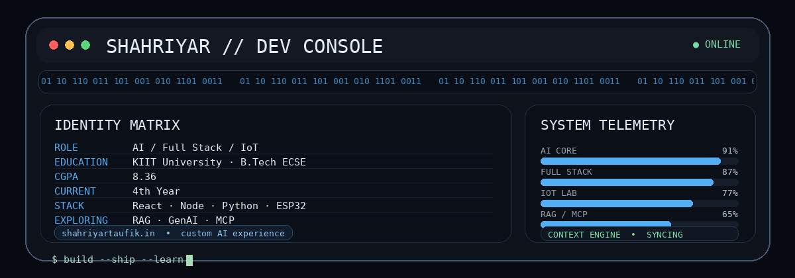

👋 Hi, I'm Shahriyar Taufik

AI/ML • Full Stack • IoT • Embedded Systems • B.Tech ECSE @ KIIT

  
  
  
  

🧑‍💻 whoami

Shahriyar Taufik
│
├── 🎓  B.Tech — Electronics & Computer Science Engineering @ KIIT University
├── 📚  4th Year | CGPA: 8.36
│
├── 🧠  AI/ML
│   ├── Machine Learning
│   ├── Deep Learning
│   ├── Generative AI
│   ├── RAG
│   └── EEG / Signal Processing
│
├── 🌐  Full Stack
│   ├── React / Vite / TypeScript
│   ├── Node.js / Express
│   ├── Flask / Django
│   └── MySQL / MongoDB
│
├── 🔌  IoT / Embedded
│   ├── ESP32
│   ├── Arduino
│   ├── Sensor Integration
│   └── Hardware + Software Systems
│
└── ⚡  Philosophy: Build → Break → Learn → Ship

I like building systems that connect software, intelligence and the physical world — from AI applications and web platforms to ESP32-powered prototypes and signal-processing projects.

🚀 What I Build

<table>
<tr>
<td align="center" width="33%">

🧠 AI / ML

Machine Learning
Deep Learning
Generative AI
RAG Applications
Signal Processing
Computer Vision

</td>
<td align="center" width="33%">

🌐 Full Stack

React + Vite
Node + Express
Python Backends
REST APIs
MongoDB / MySQL
Deployment

</td>
<td align="center" width="33%">

🔌 IoT / Embedded

ESP32
Arduino
Sensors
Embedded Control
IoT Automation
Hardware Prototyping

</td>
</tr>
</table>

⭐ Top Projects

My portfolio is built around three layers: intelligent software, polished web experiences, and connected hardware.

🤖 shahriyartaufik.in — Personal Portfolio + Custom AI

My main personal product — a developer portfolio with an AI experience built directly into the website.

The site is designed to be more than a portfolio: visitors can explore my work and interact with a custom assistant whose behavior is configured around the website experience.

AI Experience

🧠 Conversation-aware context — keeps track of the ongoing conversation so follow-up questions can remain coherent.

🔐 Login-aware personalization — for authenticated users, relevant conversation context can be associated with their account for a more personalized experience.

🧩 Context continuity — earlier turns can influence later responses instead of every prompt being treated as isolated.

😏 Sarcasm + irony — the assistant can deliberately respond with a sarcastic or ironic tone when appropriate.

🔥 Context-aware roasting — when provoked or mistreated, it can produce playful, situation-specific roasts rather than repeating a fixed insult.

🎭 Dynamic personality — can move between helpful, professional, humorous, sarcastic and playful conversational styles.

🧠 RAG / knowledge integration — designed as a foundation for grounded, website-aware AI interactions.

🔌 MCP-ready architecture — exploring tool-connected AI workflows through Model Context Protocol.

Conceptual Architecture

                        ┌──────────────────────┐
                        │   shahriyartaufik.in  │
                        └──────────┬───────────┘
                                   │
             ┌─────────────────────┼─────────────────────┐
             ▼                     ▼                     ▼
        Portfolio UI         Authentication         AI Chat UI
                                   │                     │
                                   └──────────┬──────────┘
                                              ▼
                                  ┌─────────────────────┐
                                  │ Conversation Context │
                                  ├─────────────────────┤
                                  │ User-aware Memory   │
                                  │ Personality Layer   │
                                  │ RAG / Knowledge     │
                                  │ MCP / Tools         │
                                  └──────────┬──────────┘
                                             ▼
                                      AI Response

Core idea: build an AI assistant that can maintain conversational continuity, personalize interactions for authenticated users, and express a distinctive personality instead of behaving like a generic Q&A widget.

AI LLM RAG MCP Conversation Memory Authentication Personalized AI Web

🍎 FruitnVeg — AI Vision Project

An AI-powered fruit-and-vegetable recognition/classification project deployed through a Hugging Face Space.

The project reflects my interest in taking machine-learning models beyond notebooks and putting them into an accessible interactive application.

Python AI/ML Computer Vision Hugging Face

💧 AquaHarvest — Harvesting Drinking Water From Air

A hardware prototype for atmospheric-water harvesting using thermoelectric cooling.

The system uses a Peltier TEC1-12706, environmental sensing and embedded control to explore moisture condensation from humid air.

Core hardware

Peltier TEC1-12706 DHT11 Arduino CPU Heatsink Fan

System flow

Ambient Humid Air
       ↓
   Peltier Cooling
       ↓
 Moisture Condensation
       ↓
    Water Collection
       ↑
DHT11 → Arduino Control

This project represents the hardware side of my profile: taking a physical engineering idea and connecting it to sensors, control logic and software.

🧩 Other Builds

These projects are intentionally kept lower in the profile so the main emphasis stays on my AI product work, FruitnVeg and hardware engineering.

🌐 ATOM — KIIT Fest IoT Website

Front-end contribution for the KIIT Fest IoT Bakeoff website.

Built around the ATOM identity with branding, search, responsive UI and animated web interactions.

React Vite JavaScript CSS Netlify

🏆 Smart Flow — Smart India Hackathon

Group-led project focused on an AI-based timetable generation system aligned with the NEP 2020 framework.

AI Scheduling Optimization Python

🕵️ Super Skip — Skip Tracing Platform

A full-stack skip-tracing / information-retrieval platform built with a Node.js backend, MongoDB and a Python BeautifulSoup scraping component.

Frontend
   ↓
Node.js / Express
   ↓
MongoDB
   ↓
Python + BeautifulSoup

Node.js Express MongoDB Python BeautifulSoup

🎮 Game Development

Smaller projects used to experiment with programming, interaction and gameplay logic:

2-player-games single-player-mini-games

🔌 ESP32 / IoT Experiments

Hands-on experiments with:

ESP32 Arduino DHT11 BH1750 MPU-6050 HC-SR04 OLED SSD1306 Servo LEDs Buzzers

🧰 Tech Arsenal

Languages

Frontend / Backend

AI / Data

Pandas NumPy Seaborn Jupyter Signal Processing RAG MCP RAG MCP

Databases / APIs

Cloud / Dev Tools

Hardware / Design

🤖 AI / GenAI Direction

focus:
  - Generative AI
  - Retrieval-Augmented Generation (RAG)
  - AI application development
  - Model experimentation
  - Signal processing
  - Computer Vision
  - AI + Full Stack integration

goal:
  - Build useful AI systems
  - Connect models to real applications
  - Move from prototypes toward production-oriented systems

💼 Experience & Learning

☁️ AWS Academy — GenAI Virtual Internship

Completed a 10-week virtual internship focused on Generative AI.

Generative AI AWS AI Applications

🤖 AICTE / EduSkills — AI/ML Internship

Completed a 10-week virtual AI/ML internship through the EduSkills ecosystem, with Google for Developers support referenced in my experience.

Artificial Intelligence Machine Learning Python

🏅 Certifications & Coding

🟢 React Certification — HackerRank

⭐ 5 Stars in C — HackerRank

☁️ AWS Academy Certification

🪶 GSSOC'24 / Postman Challenge badge

🔧 Multiple hands-on AI, web and IoT projects

📊 GitHub Dashboard

 

  

📈 Contribution Graph

🐍 Contribution Snake

Note: The snake image requires the Platane/snk GitHub Action to be enabled in the profile repository.

🖥️ Developer Console

<b>Console telemetry</b>

role: AI / Full Stack / IoT
education: KIIT University — B.Tech ECSE
cgpa: 8.36
current: 4th Year
building:
  - AI-powered web applications
  - RAG / GenAI experiences
  - ESP32 + IoT systems
exploring:
  - MCP
  - AI Agents
  - production-oriented AI systems
status: ONLINE

🌍 Beyond the Code

I enjoy:

🎮 Game development

🧠 Training and experimenting with AI models

🔌 IoT and electronics

🌐 Building websites and digital products

🧩 Turning academic ideas into working prototypes

📫 Connect With Me

Build something. Learn something. Ship something.

