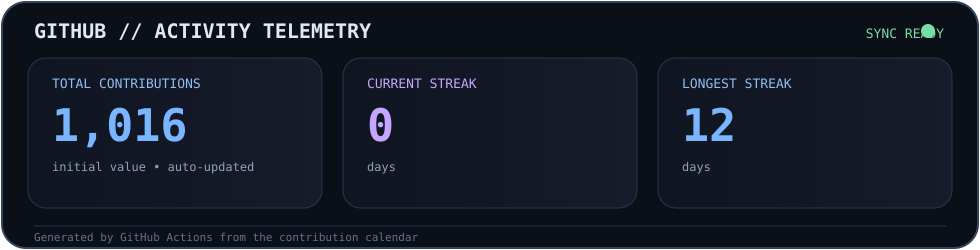

<div align="center">

# 👋 Shahriyar Taufik

### `AI/ML` · `RAG` · `MCP` · `Full Stack` · `IoT` · `Embedded Systems`

<p>
<a href="https://shahriyartaufik.in/"><b>🌐 Portfolio</b></a>
&nbsp;•&nbsp;
<a href="https://www.linkedin.com/in/shahriyar-taufik-19662b287/"><b>💼 LinkedIn</b></a>
&nbsp;•&nbsp;
<a href="https://github.com/DeathSHMASHER"><b>💻 GitHub</b></a>
</p>


</div>

---

## 🧑‍💻 About Me

```text
Shahriyar Taufik
├─ B.Tech ECSE @ KIIT University
├─ 4th Year · CGPA 8.36
├─ AI / ML · RAG · MCP · GenAI
├─ Full Stack · React · Node.js · Python
├─ IoT / Embedded · ESP32 · Arduino · Sensors
└─ Build → Break → Learn → Ship
```

I build end-to-end systems where **AI, software and hardware meet** — from intelligent web products and RAG-oriented applications to connected ESP32 prototypes and practical engineering projects.

---

# 🚀 Flagship Projects

## 🤖 shahriyartaufik.in — Personal Portfolio + Custom AI

My main personal product: a developer portfolio that includes a custom AI experience as part of the website itself.

### What makes the AI different

- 🧠 **Conversation context** — maintains the flow of an ongoing conversation so follow-up questions can reference previous turns.
- 🔐 **Login-aware personalization** — authenticated users can have relevant conversational context associated with their account.
- 🧩 **Context continuity** — responses can be shaped by earlier turns rather than treating every prompt as isolated.
- 😏 **Sarcasm & irony** — can intentionally switch into a sarcastic or ironic conversational style.
- 🔥 **Context-aware roasting** — when provoked or mistreated, it can respond with playful, situation-specific roasts instead of a fixed response.
- 🎭 **Personality layer** — can move between helpful, professional, humorous, sarcastic and playful styles.
- 📚 **RAG direction** — designed to support grounded, website-aware responses.
- 🔌 **MCP direction** — exploring tool-connected AI workflows through Model Context Protocol.

```text
                  shahriyartaufik.in
                          │
          ┌───────────────┼───────────────┐
          ▼               ▼               ▼
     Portfolio UI   Authentication     AI Chat
                          │               │
                          └───────┬───────┘
                                  ▼
                    ┌────────────────────────┐
                    │ Conversation Context   │
                    │ User-aware Memory      │
                    │ Personality / Tone     │
                    │ RAG / Knowledge        │
                    │ MCP / Tools            │
                    └────────────┬───────────┘
                                 ▼
                           AI Response
```

`AI` `LLM` `RAG` `MCP` `Authentication` `Conversation Memory` `Personalized AI` `Web`

**Live:** [shahriyartaufik.in](https://shahriyartaufik.in/)

---

## 🍎 FruitnVeg — AI Vision

AI-powered fruit and vegetable recognition/classification, deployed through a **Hugging Face Space**.

`Python` `AI/ML` `Computer Vision` `Hugging Face`

---

## 💧 AquaHarvest — Water From Air

An atmospheric-water harvesting prototype built around thermoelectric cooling.

**Core hardware:** `Peltier TEC1-12706` `DHT11` `Arduino` `CPU Heatsink` `Fan`

```text
Humid Air
   ↓
Peltier Cooling
   ↓
Condensation
   ↓
Water Collection
   ↑
DHT11 → Arduino Control
```

---

# 🧩 Additional Projects

<details>
<summary><b>🌐 ATOM — KIIT Fest IoT Website</b></summary>

Front-end contribution for the KIIT Fest IoT Bakeoff website, built around the **ATOM** identity with search, responsive UI, branding and animated interactions.

`React` `Vite` `JavaScript` `CSS` `Netlify`

</details>

<details>
<summary><b>🏆 Smart Flow — Smart India Hackathon</b></summary>

Group-led project for an AI-based timetable generation system aligned with the **NEP 2020** framework.

`AI` `Scheduling` `Optimization` `Python`

</details>

<details>
<summary><b>🕵️ Super Skip — Skip Tracing Platform</b></summary>

Full-stack skip-tracing / information-retrieval platform using a Node.js backend, MongoDB and a Python BeautifulSoup scraping component.

```text
Frontend → Node.js / Express → MongoDB
                       └──────→ Python / BeautifulSoup
```

`Node.js` `Express` `MongoDB` `Python` `BeautifulSoup`

</details>

<details>
<summary><b>🎮 Games + ESP32 Lab</b></summary>

Game-development experiments plus embedded work with:

`ESP32` `Arduino` `DHT11` `BH1750` `MPU-6050` `HC-SR04` `OLED SSD1306` `Servo` `LEDs` `Buzzers`

</details>

---

# 🛠️ Tech Arsenal

### AI / Data
`Python` `PyTorch` `TensorFlow` `scikit-learn` `Pandas` `NumPy` `RAG` `MCP` `Signal Processing`

### Web
`React` `Vite` `TypeScript` `JavaScript` `Node.js` `Express` `Flask` `Django` `Tailwind`

### Databases / Cloud / Tools
`MongoDB` `MySQL` `PostgreSQL` `Git` `GitHub` `Docker` `AWS` `GCP` `Linux` `Postman` `VS Code`

### Hardware
`ESP32` `Arduino` `Raspberry Pi` `Sensors` `Embedded Systems`

---

# 📊 GitHub Activity

<div align="center">



</div>

> This dashboard is generated from your GitHub contribution calendar by GitHub Actions. The same workflow refreshes the contribution snake.

---

# 🐍 Contribution Snake

<div align="center">

<picture>
  <source media="(prefers-color-scheme: dark)" srcset="https://raw.githubusercontent.com/DeathSHMASHER/DeathSHMASHER/output/github-contribution-grid-snake-dark.svg">
  <source media="(prefers-color-scheme: light)" srcset="https://raw.githubusercontent.com/DeathSHMASHER/DeathSHMASHER/output/github-contribution-grid-snake.svg">
  
</picture>

</div>

> Refresh: every 15 minutes + repository pushes + manual workflow runs. GitHub may delay scheduled jobs or contribution-calendar updates.

---

# 🎓 Education & Experience

**KIIT University** — B.Tech, Electronics & Computer Science Engineering  
**4th Year · CGPA 8.36**

**AWS Academy — GenAI Virtual Internship**  
Completed a 10-week virtual internship focused on Generative AI.

**AICTE / EduSkills — AI/ML Internship**  
Completed a 10-week virtual AI/ML internship.

---

# 🏅 Certifications & Coding

`React — HackerRank` · `5★ C — HackerRank` · `AWS Academy` · `GSSOC'24 / Postman Challenge`

---

# 🌍 Beyond the Code

🎮 Game development  
🧠 AI model experimentation  
🔌 IoT and electronics  
🌐 Web products  
🧩 Hardware + software prototypes

---

<div align="center">

### `Build something. Learn something. Ship something.`

</div>
