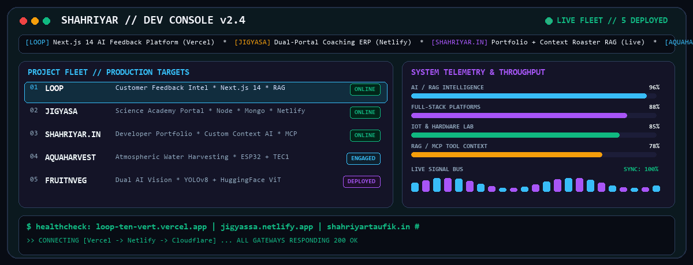

<div align="center">

# 👋 Shahriyar Taufik

### `AI/ML` · `RAG` · `MCP` · `Full Stack` · `IoT` · `Embedded Systems`

<p>
<a href="https://shahriyartaufik.in/"><b>🌐 Portfolio</b></a>
&nbsp;•&nbsp;
<a href="https://www.linkedin.com/in/shahriyar-taufik-19662b287/"><b>💼 LinkedIn</b></a>
&nbsp;•&nbsp;
<a href="https://github.com/DeathSHMASHER"><b>💻 GitHub</b></a>
</p>

<p>
  <a href="https://badges.parchment.com/public/assertions/1OhNk2tKQFarYBIhLtB_GA?identity__email=2330111@kiit.ac.in"></a>
  &nbsp;
  <a href="https://drive.google.com/file/d/1fz4H4PZ39DUV3VBLDi_5hl_4VDtKbgaE/view?usp=drive_link"></a>
  &nbsp;
  <a href="https://drive.google.com/file/d/1Tykamm1hTmY36A6Hq_Wdhm_aOxImayBj/view?usp=drive_link"></a>
</p>



</div>

---

## 🧑‍💻 About Me

```text
Shahriyar Taufik
├─ B.Tech ECSE @ KIIT University (4th Year · CGPA 8.36)
├─ 🚀 GSoC '24 Batch · Postman API Challenge
├─ AI / ML · RAG · MCP · GenAI
├─ Full Stack · React · Next.js · Node.js · Python
├─ IoT / Embedded · ESP32 · Arduino · Sensors
└─ Build → Break → Learn → Ship
```

I build end-to-end systems where **AI, software and hardware meet** — from intelligent enterprise platforms and RAG-oriented web applications to connected ESP32 prototypes and practical engineering projects.

---

# 🚀 Flagship Projects

<details open>
<summary><b><a href="https://shahriyartaufik.in/">🤖 shahriyartaufik.in — Personal Portfolio + Custom AI with Context & Tone Memory</a></b> &nbsp;<code>React</code> <code>RAG</code> <code>MCP</code> <code>Memory</code> <code>Live ↗</code></summary>
<br>

> **Live Application:** [shahriyartaufik.in](https://shahriyartaufik.in/) &nbsp;•&nbsp; **Focus:** Personalized AI · Context Continuity · RAG & Tool Execution

My personal product and flagship developer portfolio featuring an integrated, custom conversational AI that goes far beyond generic chatbot templates.

#### 🌟 Key Masterpieces & Standout Capabilities:
- 🧠 **Dynamic Conversation Context**: Maintains multi-turn continuity across complex discussions without losing conversational thread.
- 🔐 **Login-Aware User Memory**: Authenticated visitors have their preferences, identity, and past conversational context recalled automatically.
- 🎭 **Situational Personality Engine**: Seamlessly pivots between professional engineering explanations, witty banter, and playful, context-aware roasts when provoked.
- 📚 **Grounded RAG Pipeline**: Grounded on my actual project codebase, education history, and engineering blogs for hyper-accurate answers.
- 🔌 **Model Context Protocol (MCP)**: Implements structured tool-use patterns to interact with live backend data and external services.

```text
                  shahriyartaufik.in
                          │
          ┌───────────────┼───────────────┐
          ▼               ▼               ▼
     Portfolio UI   Authentication     AI Chat
                          │               │
                          └───────┬───────┘
                                  ▼
                    ┌────────────────────────┐
                    │ Conversation Context   │
                    │ User-aware Memory      │
                    │ Personality / Tone     │
                    │ RAG / Knowledge        │
                    │ MCP / Tools            │
                    └────────────┬───────────┘
                                 ▼
                           AI Response
```

**Tech Stack:** `React` `JavaScript` `Node.js` `RAG` `MCP` `Vector Search` `Tailwind CSS`

<p align="right"><a href="https://shahriyartaufik.in/"><b>Visit Live Website ↗</b></a></p>

</details>

---

<details close>
<summary><b><a href="https://loop-ten-vert.vercel.app/login">🔄 Project LOOP — AI Customer-Feedback Intelligence Platform</a></b> &nbsp;<code>Next.js 14</code> <code>TypeScript</code> <code>Prisma</code> <code>RAG</code> <code>Live ↗</code></summary>
<br>

> **Live Application:** [loop-ten-vert.vercel.app](https://loop-ten-vert.vercel.app/login) &nbsp;•&nbsp; **Repository:** [DeathSHMASHER/LOOP](https://github.com/DeathSHMASHER/LOOP) &nbsp;•&nbsp; **Focus:** Enterprise B2B SaaS · Multi-Tenant AI · VoC Analytics

Project LOOP is an enterprise-grade multi-tenant intelligence platform engineered to solve customer-feedback fragmentation for modern product, engineering, and support teams. It ingests scattered feedback across support tickets, app reviews, survey responses, and sales notes, automatically extracting actionable sentiment, clustering emergent themes, and enabling natural-language grounded RAG search.

#### 🌟 Key Masterpieces & Standout Capabilities:
- 🛡️ **Enterprise Multi-Tenant Isolation & Triple-Tier RBAC**: Complete workspace isolation enforced at database query level (`workspaceId` scoping via Prisma ORM) with strict role-based access control:
  - 🛡️ **Admin**: Organization management, member role assignments, ingestion pipeline setup.
  - ⚡ **Analyst**: Manual & batch CSV ingestion, inline status triage, AI re-classification, and Voice-of-Customer (VoC) report generation.
  - 👁️ **Viewer**: Read-only access to interactive telemetry, feedback inbox, trend graphs, and VoC digests.
- 🤖 **Structured Dual-Engine AI Intelligence**:
  - **Auto-Classification (AI1)**: Sub-second sentiment extraction (`POSITIVE`, `NEUTRAL`, `NEGATIVE`), continuous polarity scoring (`-1.0` to `+1.0`), granular theme taxonomy, and feature area mapping validated with strict Zod schemas.
  - **Theme Clustering & Anomaly Spike Detection (AI2)**: Unsupervised clustering groups scattered feedback into trending product themes, identifying emerging software bugs and sudden surges in customer friction before they impact retention.
- 💬 **Grounded RAG ("Ask LOOP AI")**: Empowers product managers to query the workspace's entire feedback lake in plain English (*"Why are users complaining about the mobile checkout flow?"*) with citation-backed, actionable insights.
- 📥 **High-Throughput Ingestion & Connector Simulation**: Built-in single-ticket manual submission, batch CSV parsing via `papaparse` with row-level error validation, and simulated webhook feeds for Zendesk, App Store, and Twitter.
- 🔐 **Secure Authentication**: Credentials authentication alongside seamless Google OAuth via NextAuth.

```text
                   User Feedback Streams
        (Zendesk · App Store · CSV · Twitter · Support)
                             │
                             ▼
                 Next.js 14 Ingestion Engine
                             │
             ┌───────────────┴───────────────┐
             ▼                               ▼
    AI Auto-Classification          Theme Clustering & Spikes
    • Sentiment (-1.0 to +1.0)      • Dynamic Pain Point Groups
    • Feature Area & Taxonomy       • Anomaly Spike Detector
    • Structured Zod Validation     • Churn-Risk Flagging
             │                               │
             └───────────────┬───────────────┘
                             ▼
              Prisma ORM + Tenant-Isolated DB
                             │
             ┌───────────────┼───────────────┐
             ▼               ▼               ▼
      VoC Executive    Interactive Triage   Grounded RAG
      Summary Reports   (New/Review/Action) ("Ask LOOP AI")
```

**Tech Stack:** `Next.js 14 (App Router)` `TypeScript 5` `Prisma ORM` `PostgreSQL` `Tailwind CSS` `Zod` `NextAuth / Google OAuth` `RAG Engine` `Papaparse`

<p align="right"><a href="https://loop-ten-vert.vercel.app/login"><b>Launch Project LOOP ↗</b></a></p>

</details>

---

<details close>
<summary><b><a href="https://jigyassa.netlify.app/">🎓 Jigyasa Science Academy — Full-Stack Coaching & Dual-Portal Ecosystem</a></b> &nbsp;<code>Node.js</code> <code>Express</code> <code>MongoDB</code> <code>Netlify</code> <code>Live ↗</code></summary>
<br>

> **Live Application:** [jigyassa.netlify.app](https://jigyassa.netlify.app/) &nbsp;•&nbsp; **Student Portal:** [Portal Login](https://jigyassa.netlify.app/student-portal) &nbsp;•&nbsp; **Admissions:** [Apply Online](https://jigyassa.netlify.app/admission) &nbsp;•&nbsp; **Repository:** [DeathSHMASHER/Coching](https://github.com/DeathSHMASHER/Coching)

A full-stack, production-grade educational management platform and coaching portal custom-engineered for **Jigyasa Science Academy** (founded and taught by Shahriyar Taufik), serving Class 5–12 CBSE, ICSE, and West Bengal Board students across Physics, Mathematics, Science, and Python Coding.

#### 🌟 Key Masterpieces & Standout Capabilities:
- 🏛️ **Director Desk & Administrative Control Hub (`/admin-portal.html`)**: Centralized command center for academy operations featuring live telemetry on total admissions, batch capacities, attendance averages, student record management (CRUD), course enrollment verification, and direct student query resolution.
- 🎓 **Personalized Student Portal (`/student-portal.html`)**: Enrolled students access an individual dashboard tracking attendance rates, test performance progression curves, digital notice board announcements, fee payment verification, and an interactive 24/7 doubt submission desk.
- 📝 **Dynamic Admissions Engine (`/admission.html`)**: Multi-step application pipeline with real-time validation, board selection (CBSE / ICSE / WBBSE / WBCHSE), course specialization (Foundation, Board & Competitive Physics/Maths, Python Coding for Beginners), and automated database ingestion.
- ⭐ **Dynamic Feedback & Live Community Index**: Real-time review aggregation displaying verified student and parent feedback, curriculum ratings, and performance highlights.
- ⚡ **High-Performance Edge Architecture**: Deployed with Netlify Serverless Functions (`functions/api.js`) for zero-cold-start edge delivery, an Express backend, and MongoDB Atlas database with responsive custom UI and WhatsApp Business API connectivity.

```text
                       Jigyasa Web Ecosystem
                      (jigyassa.netlify.app)
                                 │
         ┌───────────────────────┼───────────────────────┐
         ▼                       ▼                       ▼
    Public Portal          Student Portal          Director Desk
   • Course Catalog       • Attendance Track      • Student CRUD
   • Online Admissions    • Performance Graphs    • Batch Scheduling
   • Dynamic Reviews      • 24/7 Doubt Desk       • Admissions Queue
   • WhatsApp Inquiries   • Notice Board Tracker  • Query Resolution
         │                       │                       │
         └───────────────────────┼───────────────────────┘
                                 ▼
                     Netlify Serverless Edge
                   & Node.js Express REST API
                                 │
                                 ▼
                     MongoDB Atlas Cloud DB
```

**Tech Stack:** `JavaScript (ES6+)` `Node.js` `Express` `MongoDB Atlas` `Netlify Serverless Functions` `REST API` `HTML5 / CSS3`

<p align="right"><a href="https://jigyassa.netlify.app/"><b>Visit Jigyasa Science Academy ↗</b></a></p>

</details>

---

<details open>
<summary><b><a href="https://huggingface.co/spaces/NEwBEE67/FruitnVeg">🍎 FruitnVeg — Dual-Engine AI Vision (YOLOv8 + ViT)</a></b> &nbsp;<code>Python</code> <code>PyTorch</code> <code>YOLOv8</code> <code>ViT</code> <code>Hugging Face</code> <code>Live ↗</code></summary>
<br>

> **Live Application:** [huggingface.co/spaces/NEwBEE67/FruitnVeg](https://huggingface.co/spaces/NEwBEE67/FruitnVeg) &nbsp;•&nbsp; **Repository:** [DeathSHMASHER/Fruit-and-veg-](https://github.com/DeathSHMASHER/Fruit-and-veg-) &nbsp;•&nbsp; **Deployment:** Hugging Face Space &nbsp;•&nbsp; **Focus:** Dual-Model Computer Vision

An AI-powered computer vision pipeline running two state-of-the-art vision models in parallel for real-time produce recognition, localization, and classification.

#### 🌟 Key Masterpieces:
- 🎯 **Parallel Dual-Model Inference Pipeline**:
  - **YOLOv8 Object Detection**: Swiftly draws bounding boxes and localizes produce classes (apple, banana, orange, broccoli, carrot) in the scene.
  - **Hugging Face Vision Transformer (ViT)**: Fine-tuned classifier covering 36 distinct produce classes (including mango, kiwi, eggplant, spinach) running simultaneously on the full frame and cropped regions for fine-grained classification.
- ⚡ **Interactive Web Interface**: Streamlit / Gradio powered deployment on Hugging Face Spaces for real-time image upload and inference visualization.

**Tech Stack:** `Python` `PyTorch` `YOLOv8` `Vision Transformer (ViT)` `Hugging Face` `OpenCV`

<p align="right"><a href="https://huggingface.co/spaces/NEwBEE67/FruitnVeg"><b>Try FruitnVeg Live on Hugging Face ↗</b></a></p>

</details>

---

<details close>
<summary><b><a href="https://github.com/DeathSHMASHER">💧 AquaHarvest — Atmospheric Water Harvesting Prototype</a></b> &nbsp;<code>ESP32</code> <code>Arduino</code> <code>Thermoelectric</code> <code>IoT</code></summary>
<br>

> **Focus:** Hardware Prototyping · Thermoelectric Cooling · Embedded Control Loops

An atmospheric-water harvesting prototype designed to extract potable water directly from ambient humid air using thermoelectric cooling mechanisms.

#### 🌟 Key Masterpieces:
- ❄️ **Thermoelectric Condensation Core**: Built around high-performance Peltier TEC1-12706 cooling elements coupled with CPU heat sink arrays and cooling fans.
- 🌡️ **Closed-Loop Microcontroller Automation**: Integrates DHT11 relative humidity and temperature sensors monitored by Arduino / ESP32 to calculate the dew point dynamically and regulate Peltier power cycles for maximum condensation efficiency.

```text
Humid Air
   ↓
Peltier Cooling (TEC1-12706)
   ↓
Condensation Chamber
   ↓
Potable Water Collection
   ↑
DHT11 Sensor → Arduino / ESP32 Feedback Loop
```

**Tech Stack:** `Peltier TEC1-12706` `DHT11` `Arduino` `ESP32` `C/C++` `Embedded Hardware`

</details>

---

# 🧩 Additional Projects

<details>
<summary><b><a href="https://github.com/DeathSHMASHER/ATOM">🌐 KIIT Fest 25 — KIIT Fest IoT Website</a></b> &nbsp;<code>React</code> <code>Vite</code> <code>JavaScript</code> <code>CSS</code></summary>
<br>

Front-end web experience developed for the KIIT Fest IoT Bakeoff website, built around the **ATOM** branding identity with responsive layout, dynamic search, and custom CSS animations.

`React` `Vite` `JavaScript` `CSS` `Netlify`

</details>

<details>
<summary><b><a href="https://github.com/DeathSHMASHER/AI-Generated-TimeTable-">🏆 Smart Flow — Smart India Hackathon</a></b> &nbsp;<code>AI</code> <code>Scheduling</code> <code>Optimization</code> <code>Python</code></summary>
<br>

Group-led project for an intelligent academic timetable generator and academic advisor aligned with the **NEP 2020** framework, using optimization algorithms to balance faculty allocations, room capacities, and student course electives.

`AI` `Scheduling` `Constraint Optimization` `Python` `JavaScript`

</details>

<details>
<summary><b><a href="https://github.com/DeathSHMASHER">🕵️ Super Skip — Skip Tracing Platform</a></b> &nbsp;<code>Node.js</code> <code>Express</code> <code>MongoDB</code> <code>Python</code></summary>
<br>

Full-stack information-retrieval and skip-tracing platform pairing a high-throughput Node.js/Express API with Python BeautifulSoup data scrapers and MongoDB storage.

```text
Frontend → Node.js / Express → MongoDB
                       └──────→ Python / BeautifulSoup
```

`Node.js` `Express` `MongoDB` `Python` `BeautifulSoup`

</details>

<details>
<summary><b><a href="https://github.com/DeathSHMASHER/2-player-games">🎮 Games + ESP32 Lab</a></b> &nbsp;<code>ESP32</code> <code>TypeScript</code> <code>Arduino</code> <code>Sensors</code></summary>
<br>

Turn-based strategy and browser game experiments (`2-player-games` Element Battle in TypeScript) alongside physical computing lab work with:

`ESP32` `Arduino` `DHT11` `BH1750` `MPU-6050` `HC-SR04` `OLED SSD1306` `Servo` `LEDs` `Buzzers`

</details>

---

# 🛠️ Tech Arsenal

### AI / Data
`Python` `PyTorch` `TensorFlow` `scikit-learn` `Pandas` `NumPy` `RAG` `MCP` `YOLOv8` `Vision Transformers` `Signal Processing`

### Web
`React` `Next.js 14` `TypeScript` `JavaScript` `Node.js` `Express` `Flask` `Django` `Tailwind CSS` `Prisma ORM`

### Databases / Cloud / Tools
`MongoDB Atlas` `PostgreSQL` `MySQL` `Git` `GitHub Actions` `Docker` `AWS` `GCP` `Netlify` `Vercel` `Linux` `Postman` `VS Code`

### Hardware & IoT
`ESP32` `Arduino` `Raspberry Pi` `Peltier TEC1-12706` `DHT11` `MPU-6050` `Sensors` `Embedded Systems`

---

# 📊 GitHub Activity

<div align="center">



</div>

> This dashboard is dynamically generated from your GitHub contribution calendar by GitHub Actions. The same workflow refreshes the contribution snake.

---

# 🐍 Contribution Snake

<div align="center">

<picture>
  <source media="(prefers-color-scheme: dark)" srcset="https://raw.githubusercontent.com/DeathSHMASHER/DeathSHMASHER/output/github-contribution-grid-snake-dark.svg">
  <source media="(prefers-color-scheme: light)" srcset="https://raw.githubusercontent.com/DeathSHMASHER/DeathSHMASHER/output/github-contribution-grid-snake.svg">
  
</picture>

</div>

> Refresh: every 15 minutes + repository pushes + manual workflow runs.

---

# 🎓 Experience & Education

**Google Summer of Code (GSoC) '24 Batch — Postman API Challenge**  
Selected contributor in the GSoC '24 cohort for the Postman Challenge. Worked extensively with API architecture, Postman collection automation, environment scripting, automated integration testing suites, and webhook workflows.  
> 🔗 **Official Credential:** [Postman API Fundamentals Student Expert (Verified Badge)](https://badges.parchment.com/public/assertions/1OhNk2tKQFarYBIhLtB_GA?identity__email=2330111@kiit.ac.in)

**AWS Academy — GenAI Virtual Internship**  
Completed a 10-week virtual internship focused on Generative AI, foundational models, prompt engineering, and cloud-backed AI pipelines.  
> 🔗 **Certificate Verification:** [AWS Academy Certificate (Google Drive)](https://drive.google.com/file/d/1fz4H4PZ39DUV3VBLDi_5hl_4VDtKbgaE/view?usp=drive_link)

**AICTE / EduSkills — AI/ML Internship**  
Completed a 10-week virtual AI/ML internship covering machine learning models, statistical evaluation, and data engineering pipelines.  
> 🔗 **Certificate Verification:** [AICTE / EduSkills Certificate (Google Drive)](https://drive.google.com/file/d/1Tykamm1hTmY36A6Hq_Wdhm_aOxImayBj/view?usp=drive_link)

**KIIT University** — B.Tech, Electronics & Computer Science Engineering  
**4th Year · CGPA 8.36**

---

# 🏅 Certifications & Badges

- 🟠 **[Postman API Fundamentals Student Expert](https://badges.parchment.com/public/assertions/1OhNk2tKQFarYBIhLtB_GA?identity__email=2330111@kiit.ac.in)** — Issued by Postman / Parchment (Nov 2024)
- ☁️ **[AWS Academy Graduate — GenAI](https://drive.google.com/file/d/1fz4H4PZ39DUV3VBLDi_5hl_4VDtKbgaE/view?usp=drive_link)** — AWS Academy Virtual Internship
- 🤖 **[AICTE / EduSkills — AI/ML Specialist](https://drive.google.com/file/d/1Tykamm1hTmY36A6Hq_Wdhm_aOxImayBj/view?usp=drive_link)** — AICTE Virtual Internship
- ⚛️ **React (Basic)** — HackerRank Certified
- ⭐ **5★ Problem Solving & C** — HackerRank

---

# 🌍 Beyond the Code

🎮 Game development & physics simulations  
🧠 AI model experimentation, RAG & MCP tool integration  
🔌 IoT, sensor integration & microcontroller prototyping  
🌐 Full-stack SaaS & enterprise web products  
🧩 Connecting hardware signals to modern web applications

---

<div align="center">

### `Build something. Learn something. Ship something.`

</div>
